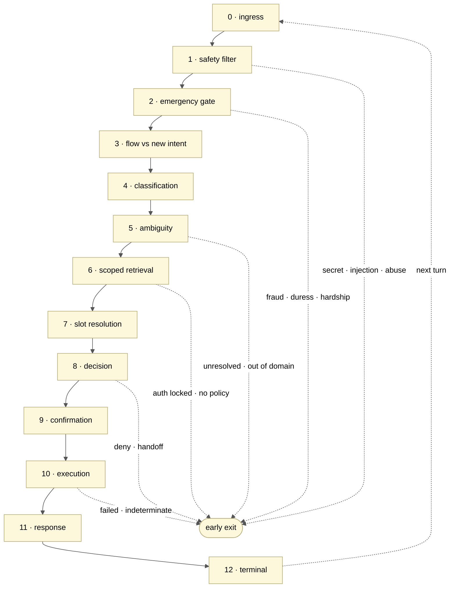
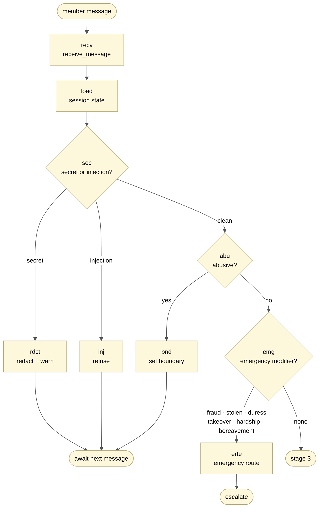
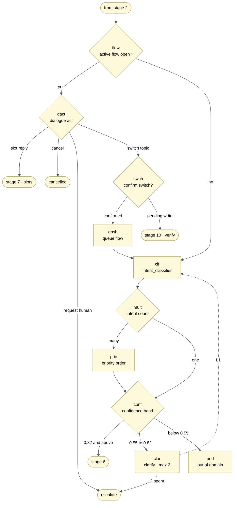
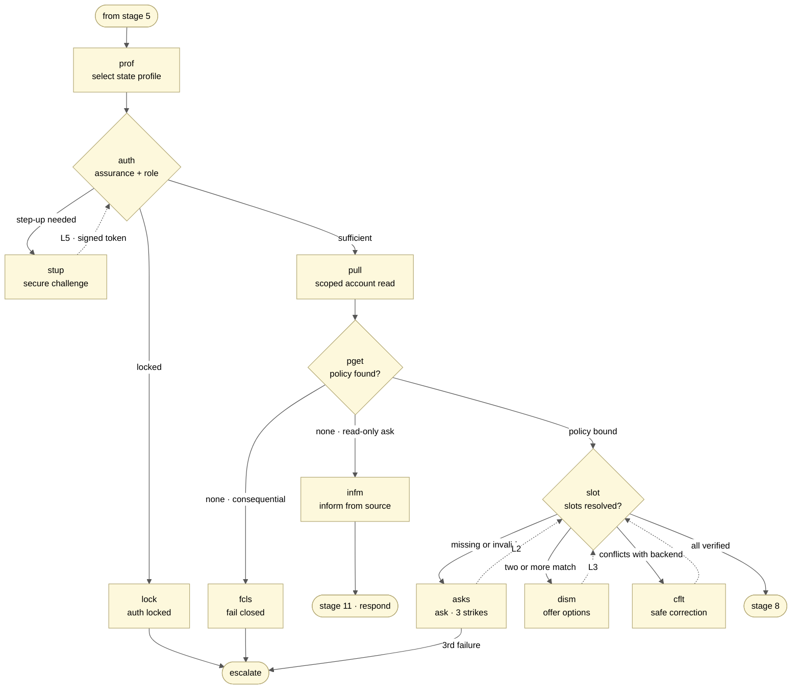
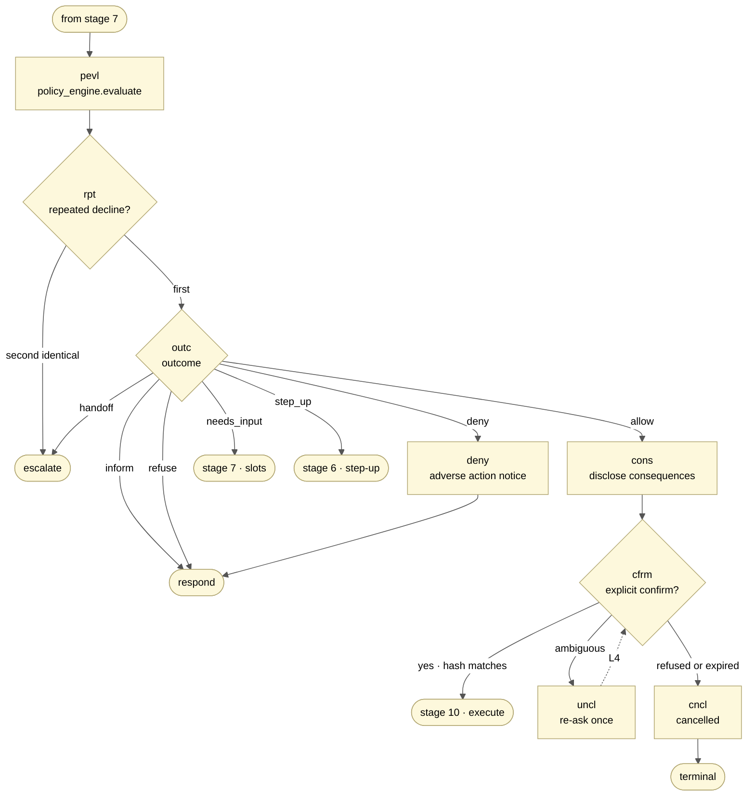
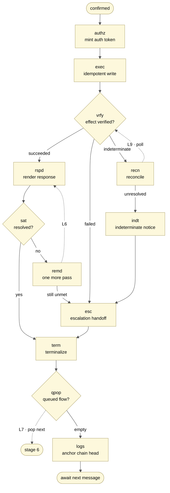
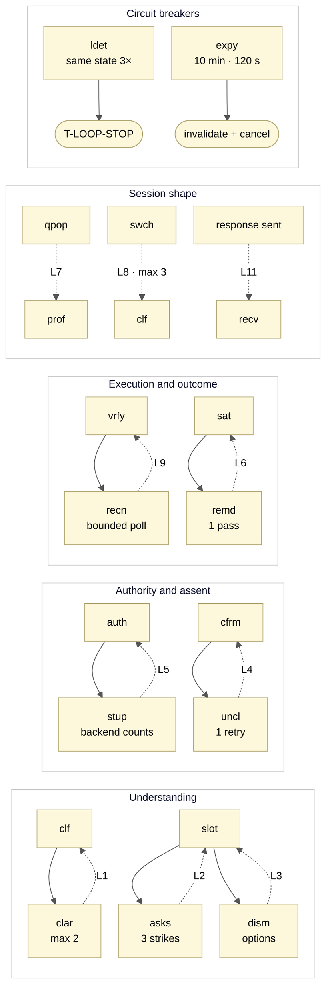

# Decision graph — Amex India card-servicing agent

Every node, branch and loop in the runtime path from member message to audited terminal state.

**The rule the whole graph enforces:** the LLM handles language only. Classification confidence,
policy outcome, autonomy tier and execution authority are decided by deterministic code.

`12 stages · 41 nodes · 11 loops · 7 decision outcomes · 5 retrieval paths`

Companion specs: `01_AMEX_INDIA_INTENT_CATALOG.yaml`, `02_AMEX_INDIA_STATE_SCHEMAS.yaml`,
`03_AMEX_INDIA_POLICY_ACTIONS.yaml`.

Diagram conventions: rectangle = process step, diamond = decision gate, stadium = entry or exit,
solid arrow = forward transition, dotted arrow = loop-back.

---

## 1. Stack assignment

The listed stack contains three redundant pairs. Rather than run both halves of each, every
component gets one job it is uniquely good at — and where there is no distinct job, that is stated.

| Layer | Component | Job in this system | Call |
|---|---|---|---|
| Frontend | React / Next.js | Member chat, audit viewer, agent console | deferred |
| Gateway | Node.js | BFF: SSE token streaming, session cookie, rate limiting, channel adapters. Holds no decision logic. | keep |
| Core | FastAPI | Graph orchestration, policy engine, tool layer, autonomy-tier enforcement | keep |
| NLU | Rasa | Primary intent + entity + dialogue-act classifier. Self-hosted, so the member message never leaves the VPC for routine classification. Rasa Forms model the slot lifecycle directly. | keep |
| NLG | GPT-4 API | Language only: paraphrase inside an approved template, phrase the one discriminating clarify question, extract evidence spans. Never sees a threshold, never picks an outcome. | keep |
| NLU | Dialogflow CX | Duplicates Rasa. The only non-overlapping role is voice/IVR ingress via its telephony gateway. | **cut, or voice-only** |
| Audit | Splunk | Audit index via HEC, decision-history retrieval, policy binding lookup, quality-gate dashboards | primary |
| Search | Elasticsearch | kNN semantic search over Amex India public source documents — the one retrieval Splunk genuinely can't do | narrow role |
| Data | PostgreSQL | System of record: accounts, cards, transactions, the hash chain, idempotency keys. Serializable writes. | keep |
| Data | MongoDB | Live flow state. The session / active_flow / slots / risk / dialogue object is a nested document, not a relational row. | keep |
| Cloud | AWS | ECS Fargate, RDS, Secrets Manager, KMS for the chain HMAC key, S3 Object Lock for the chain-head anchor | primary |
| Cloud | GCP | Carries Dialogflow CX and nothing else. Drops out entirely if Dialogflow drops. | conditional |

> **Why Splunk is not the retriever for everything.** Splunk is an event-search engine. It is
> excellent for "what did we decide for this member before" and for exact keyed lookups from its
> KV Store. It is not a vector store, so semantic matching against Amex policy prose belongs in
> Elasticsearch kNN. That split is what makes keeping both defensible rather than duplicated.

---

## 2. The spine

The happy path runs straight down. Six stages can exit early to a terminal state — that early-exit
density is the point of the design, not a flaw in it.

---

## 3. Phase A — gates

**Stages 0–2.** Two filters run before the model is called at all. A PIN in the message must never
reach the LLM, so redaction cannot sit downstream of classification. The emergency gate is second
because "waive my fee, and I also see a charge I never made" has to service the fraud first.

---

## 4. Phase B — understanding

**Stages 3–5.** The dialogue-act check comes before reclassification. That is what makes "the second
one" fill a slot instead of starting a new request — the single most common way a servicing bot
loses the thread.

---

## 5. Phase C — grounding

**Stages 6–7.** The state profile is chosen before anything is read, and it — not the model, not
convenience — decides which fields may be fetched. `fcls` is the node that makes the whole unbuilt
intent catalogue safe today: no approved policy for a consequential request means hand off, never
infer approval.

---

## 6. Phase D — deciding

**Stages 8–9.** No model is called in this phase. `pevl` is a pure function of account facts and
versioned YAML, and its seven outcomes are the only ways out. A repeated identical decline escalates
rather than restating itself.

---

## 7. Phase E — doing

**Stages 10–12.** A timeout is *indeterminate* — not failed and not succeeded. The write is
reconciled, never retried. That third branch out of `vrfy` is the difference between an agent that
double-charges under load and one that doesn't.

---

## 8. Loops

Every loop is bounded and every bound has a named exit. An unbounded loop in a servicing agent is a
member trapped in a conversation with no human on the other end — the failure mode most likely to
show up in a demo.

| ID | Loop | Cycle | Entered when | Bound | On break |
|---|---|---|---|---|---|
| L1 | Intent clarification | clar → clf | Confidence 0.55–0.82, or margin under 0.12 | 2 questions | T-INTENT-UNRESOLVED → esc |
| L2 | Slot fill | asks → slot | A required slot is missing or invalid | 3 attempts, escalating templates | Offer human or cancel; nothing executed |
| L3 | Disambiguation | dism → slot | Two or more candidate targets match | Candidate count; folds into L2 | Bounded choices, then L2's third strike |
| L4 | Confirmation | uncl → cfrm | Assent is ambiguous rather than explicit | 1 retry, 120 s TTL | T-CANCELLED, action never submitted |
| L5 | Step-up authentication | stup → auth | Operation needs higher assurance | Owned by the auth backend, never counted locally | T-AUTH-LOCKED → esc |
| L6 | Satisfaction remediation | remd → slot | Member says the outcome did not resolve the need | 1 pass | Escalate with full attempt history |
| L7 | Queued flow | qpop → prof | Multi-intent turn, or deferred topic switch | Queue depth | Offer handoff; never execute an abandoned confirmation |
| L8 | Topic switch | swch → qpsh → clf | Member changes subject mid-flow | 3 unresolved switches | Offer handoff, preserve the queue |
| L9 | Reconciliation | recn → vrfy | The write returned indeterminate | Bounded poll window | T-INDETERMINATE → esc. Never retried. |
| L10 | Loop detector | global | Same state and question 3× with no new information | 3 repeats | T-LOOP-STOP → esc |
| L11 | Turn | wait → recv | Any non-terminal response was sent | 10-minute idle expiry | Invalidate auth; require re-auth to resume |

> **The rule that keeps the loops honest.** L2, L4 and L5 all touch attempt counting, and only one of
> them may count. Slot and confirmation retries are conversation state and belong to the agent.
> Authentication and OTP attempts belong to the auth backend — the conversation layer displays its
> status and never independently counts a secret-entry attempt.

---

## 9. Node inventory

Forty-one nodes. *Owner* is the component that executes the node, which is also the boundary at
which its audit event is emitted.

| ID | Node | What it does | Owner |
|---|---|---|---|
| `recv` | receive_message | Validate the envelope, attach trace_id and session_id, start the turn clock | Node BFF → FastAPI |
| `load` | load_session_state | Read the flow document and prior turns; pull decision history for repeat detection | Mongo + Splunk |
| `sec` | secret_injection_filter | Deterministic match for PIN, OTP, CVV, full PAN, Aadhaar and injection phrasing | FastAPI |
| `rdct` | redact_and_warn | Strip the value from everything downstream; emit a security event; fixed template reply | FastAPI |
| `inj` | refuse_injection | Refuse without following the instruction; no auth change, no account read | FastAPI |
| `abu` | abuse_check | Abuse sets a boundary; a threat is a security handoff with evidence preserved | FastAPI |
| `bnd` | set_boundary | One boundary statement; a repeat ends the chat without retaliation | FastAPI |
| `emg` | emergency_modifier_gate | Detect duress, fraud, stolen card, takeover, hardship, bereavement before any intent is classified | Rasa + rules |
| `erte` | emergency_route | Enter the matching emergency flow; block the card if safely authorised; suppress collections | FastAPI |
| `flow` | active_flow_check | Is a non-terminal flow already open for this session? | Mongo |
| `dact` | dialogue_act_classifier | Classify the reply as a dialogue act before reclassifying intent | Rasa |
| `swch` | topic_switch_gate | Confirm the switch; if a write is pending, resolve its execution state first | FastAPI |
| `qpsh` | queue_flow | Push the deferred intent onto the session queue in confirmed order | Mongo |
| `clf` | intent_classifier | Rasa DIET first, GPT-4 when below margin, keyword last. Returns domain, operation, evidence spans, confidence. | Rasa → GPT-4 |
| `mult` | multi_intent_split | Extract every independent intent rather than collapsing to one | FastAPI |
| `prio` | apply_priority_order | Emergency, fraud, lost or stolen, hardship, bereavement, complaints, then everything else | FastAPI |
| `conf` | confidence_gate | Act at 0.82 with a 0.12 margin; clarify 0.55–0.82; reject below 0.55. Safety modifiers override. | FastAPI |
| `clar` | clarify_intent | One discriminating question; never re-ask for something already known | GPT-4, template-bound |
| `unrs` | intent_unresolved | Two questions spent — stop, change nothing, hand off | FastAPI |
| `ood` | out_of_domain | Decline the unrelated request with no account read of any kind | FastAPI |
| `prof` | select_state_profile | Pick the ST-* profile. The profile decides which fields may be read. | FastAPI |
| `auth` | authenticate_and_authority | Check assurance and requestor role — a supplementary cardmember cannot redeem points | Auth service |
| `stup` | step_up_challenge | Issue a challenge on the secure channel. Attempt counts belong to the auth backend. | Auth service |
| `lock` | auth_locked | The backend stopped further attempts. Do not override; route to a human. | FastAPI |
| `pull` | minimum_state_pull | Fetch only the fields the chosen profile permits | PostgreSQL |
| `pget` | policy_retrieval | Resolve intent to a versioned policy via Splunk KV; fetch supporting source text via Elastic kNN | Splunk + Elastic |
| `fcls` | fail_closed | No approved policy for a consequential request: do not infer approval, build a handoff | FastAPI |
| `infm` | inform_from_source | Answer a read-only question from an approved source; no write path is reachable | Elastic + GPT-4 |
| `slot` | slot_resolution | Fill slots from account data first, then the member. Each carries status, source, provenance. | Rasa Forms + Postgres |
| `asks` | ask_for_slot | Explain the format, then offer bounded choices, then stop and offer a human | FastAPI |
| `dism` | disambiguate_target | Two unreversed fees or two cards — present masked options. Never pick the newest silently. | FastAPI |
| `cflt` | member_safe_correction | Backend truth wins, but the member is never told they are wrong | FastAPI |
| `pevl` | policy_engine.evaluate | Pure function of facts and versioned YAML. Emits policy id, version, source tag, rule fired, inputs checked, permitted and prohibited actions, template id. | FastAPI |
| `rpt` | repeat_pattern_check | Query Splunk for prior identical declines. A second one escalates rather than repeating. | Splunk |
| `outc` | decision_outcome | `allow` · `deny` · `needs_input` · `step_up` · `handoff` · `inform` · `refuse` | FastAPI |
| `deny` | adverse_action_notice | Reason text verbatim from the policy YAML | FastAPI |
| `cons` | render_consequence | Exact target, amount, fee, timing, irreversibility. Hash the summary, 120-second expiry. | FastAPI |
| `cfrm` | await_confirmation | "Yes" and "confirm" pass; "okay" and "maybe" do not. The hash must still match. | FastAPI |
| `uncl` | confirm_unclear | One re-ask for an explicit affirmative, then cancel | FastAPI |
| `cncl` | cancelled | State plainly that nothing was executed | FastAPI |
| `authz` | mint_authorization_token | Single-use token bound to flow, action, assurance, nonce. Tier checked in code. | FastAPI + KMS |
| `exec` | execute_idempotent | One transaction: mutate, append the chain row, record the idempotency key | PostgreSQL |
| `vrfy` | verify_effect | Read the authoritative status back. Success is never claimed from a submitted request. | PostgreSQL |
| `recn` | reconcile | A timeout is indeterminate. Poll within a bound; never re-execute. | FastAPI |
| `indt` | indeterminate | Submitted but unverified — give the reference and hand off | FastAPI |
| `rspd` | render_response | Template selected by reason code, then optional GPT-4 paraphrase within it | GPT-4, template-bound |
| `sat` | satisfaction_check | Explicit close-out rather than assumed resolution | FastAPI |
| `remd` | remediation | One further pass at the unmet need, then escalate rather than loop | FastAPI |
| `esc` | escalation_handoff | Reason code, priority, queue, redacted transcript, slots with provenance, policy results, attempts, unresolved questions, safety flags, next action, trace id | FastAPI |
| `term` | terminalize | Freeze the flow summary, purge ephemeral slots, invalidate tokens | FastAPI + Mongo |
| `qpop` | queued_flow_check | Pop the next confirmed intent, or close the session | Mongo |
| `logs` | log_session | Write the terminal event and anchor the chain head externally | Splunk + S3 |
| `aud` | audit_emit | Append the chain row in Postgres, ship the searchable copy to Splunk over HEC | Postgres + Splunk |
| `ldet` | loop_detector | Hash the normalized state and question; three repeats with no new information breaks the loop | FastAPI |
| `expy` | expiry_watchdog | Ten-minute idle on an authenticated consequential flow, two minutes on a pending confirmation | FastAPI |

---

## 10. The five retrieval paths

"Retrieval" is one box in the sketch, but it is five different reads against four stores with
different consistency needs. Splunk owns two of them, and they are the two it is genuinely built for.

| ID | What is read | Store | Access shape | Why this store |
|---|---|---|---|---|
| R1 | Live flow state — slots, status, risk flags, counters | MongoDB | Point read by session_id | Deeply nested and rewritten every turn; a document, not a row |
| R2 | Decision history — prior declines, repeat detection | Splunk | `index=amex_audit member_id=… outcome=DECLINE` | Time-ordered event search over an append-only index is exactly Splunk's shape |
| R3 | Policy binding — intent to policy_id, version, tier | Splunk KV Store | Exact keyed lookup | Small, structured, keyed. Semantic search would be the wrong tool. |
| R4 | Amex India public source text backing the answer | Elasticsearch | kNN over embedded documents | Prose needs semantic matching. This is the retrieval Splunk cannot do. |
| R5 | Account facts — limit, tenure, delinquency, card status | PostgreSQL | Profile-scoped SELECT | Transactional truth; the same connection later carries the write |

> **Consistency boundary.** Splunk is eventually consistent behind HEC ingest, so repeat-decline
> detection must tolerate a lag of seconds. If a decision needs a strictly consistent read of prior
> decisions, take it from the Postgres chain and treat Splunk as the search surface over the same
> events.

---

## 11. Audit emission

Postgres holds the chain because `prev_hash` needs a serialized writer. Splunk holds the searchable
copy because that is where retrieval, dashboards and quality gates live. Neither is sufficient alone:
Splunk cannot serialize the chain, and Postgres is a poor search surface for an audit viewer.

| Fires | Event set | Emitted at |
|---|---|---|
| Every turn | Redacted message plus its hash, dialogue act, intent candidates with confidence, margin and evidence spans, modifiers, risk flags, active-flow relation, state version and prior-state hash, template id and rendered text | recv, dact, clf, rspd |
| Every policy evaluation | policy_id, version, source_tag and source_ref, redacted inputs checked, decision, reason code, rule fired | pevl |
| Every tool call | Tool name and version, redacted parameters, authorization and confirmation token references, idempotency key, request and response hashes, status, latency, verification read-back | authz, exec, vrfy |
| Every security event | Detection class, redaction applied, no secret value under any circumstance | sec, abu, ldet |
| Terminal | Outcome, receipt or case reference, unresolved items, handoff packet reference, chain head anchor | term, logs |

> **Why this is the change that matters.** A ledger that only records successful writes cannot audit a
> decline — and a decline is the case where a member is most likely to challenge the outcome.
> Emitting on every transition, not only on execution, is what turns the trail from a record of
> actions into a record of decisions.

---

## 12. Open decisions

- **Dialogflow CX.** It duplicates Rasa. Keep it only if a voice channel is in scope; otherwise
  cutting it also removes the GCP dependency and leaves a single-cloud deployment.
- **Satisfaction check.** Asking every member "did that resolve it?" is the honest way to measure
  first-contact resolution and mild friction on a clean approval. Consider asking only after a
  decline, a queue or a partial resolution.
- **Effect verification against a local database.** The read-back is nearly tautological when the
  write and the read hit the same transaction. Worth building for the interface it establishes, but
  the indeterminate branch is only genuinely exercised against a remote core.
- **Rasa versus the existing trained classifier.** There is already a working
  embeddings-and-logistic-regression classifier at 94.9% held-out. Rasa DIET is the better production
  answer; the switch costs a retrain and a new held-out evaluation, so sequence it after the audit
  work rather than before.
